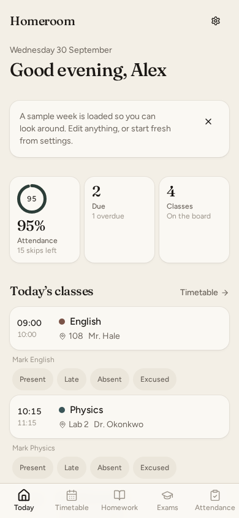
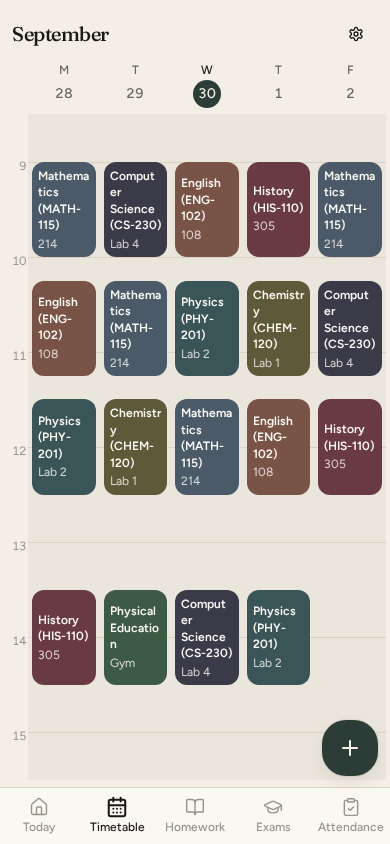
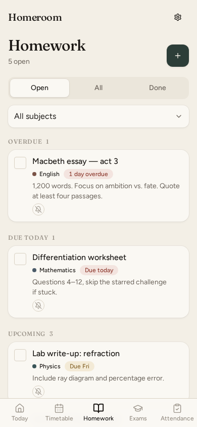
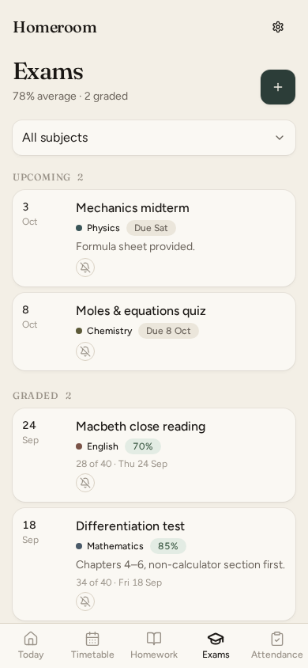
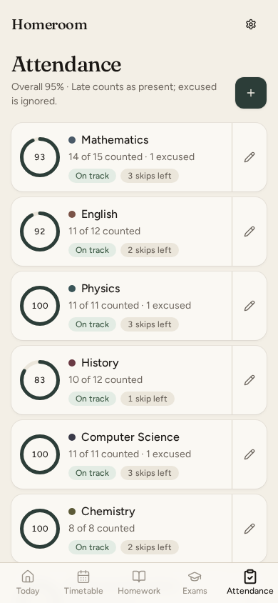

# Homeroom

A local-first student planner: timetable, homework, exams, and attendance — wrapped as a Tauri desktop/Android app with an optional web preview. No accounts, no cloud: data lives on the device (localStorage + JSON backup), with encrypted peer-to-peer LAN sync between devices.

   

## Screenshots

| Today | Timetable | Homework |
|---|---|---|
|  |  |  |

| Exams | Attendance |
|---|---|
|  |  |

## Features

- **Today** — greeting, attendance ring, classes due, homework due soon, upcoming exams
- **Timetable** — week grid with now-line, periods per subject, room labels
- **Homework / Exams** — filters, groups (open/done, upcoming/graded), per-item reminder days
- **Attendance** — per-subject stats, skip budget, month calendar, pick-any-day marking
- **Semesters** — each semester keeps its own subjects + items; sample week loader, start-fresh wipe
- **Reminders** — in-app toasts + OS notifications (class N-min, homework/exam N-days)
- **Sync** — end-to-end encrypted LAN sync (X25519 + ChaCha20). One device taps “Generate QR code” (becomes host), the other taps “Scan QR code” to pair + sync; merge-or-overwrite on first sync, auto-sync on open
- **Backup** — export/import whole database as JSON (with tombstones so deletes propagate)

## Project structure

```
src/
  main.tsx            entry (theme pre-paint, hash router)
  routes/             Today, Timetable, Homework, Exams, Attendance (plain components)
  components/         app-shell, settings-drawer, settings/*, forms, cards, ui/*
  lib/
    router.tsx        tiny hash router (Link, usePathname, search params)
    store.ts          zustand + persist database + CRUD
    types.ts          Semester/Subject/Period/Homework/Exam/Attendance/Settings
    dates.ts          zero-dep date helpers
    selectors.ts      derived queries (stats, groups, bounds)
    merge.ts          commutative sync merge + tombstones
    sync.ts           P2P orchestration (Tauri commands)
    backup.ts         export/import
    notify.ts / reminders.ts / theme.ts / toast.ts
src-tauri/
  src/lib.rs          plugins + sync commands
  src/sync.rs         TCP LAN sync (host/guest, pairing)
  capabilities/       desktop + mobile permissions
scripts/              AppImage + Android env helpers
```

## Develop

```bash
npm install
npm run dev          # web preview on :8080
npm run tauri:dev    # desktop window
npm run typecheck
npm run build        # static web build -> dist/
npm run tauri:build  # desktop bundle (AppImage)
```

Android (see `scripts/android-env.sh` for `JAVA_HOME`/`ANDROID_HOME`/`NDK_HOME`):

```bash
npm run android:dev
npm run android:apk
```

## Notes

- Hash routing (not browser history) so `tauri://` / file builds work.
- `clsx` was inlined into `lib/utils.ts`; only `tailwind-merge` is kept for `cn()`.
- Build-time packages (`vite`, `typescript`, `tailwindcss`, …) live in `devDependencies`.
- The unused `tauri-plugin-shell` was removed; the barcode scanner is dynamically imported so it stays out of the web bundle.

## License

GPL-3.0-only — see [LICENSE](LICENSE).
